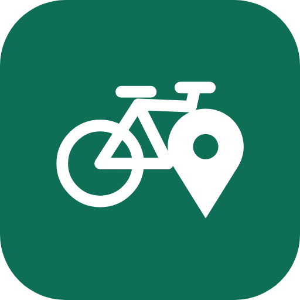
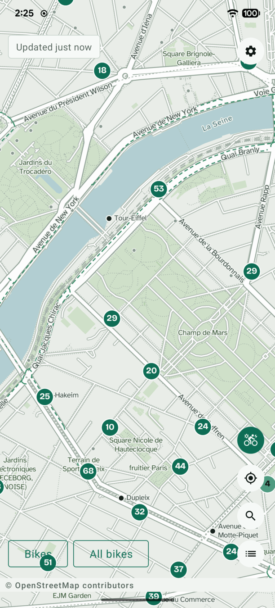
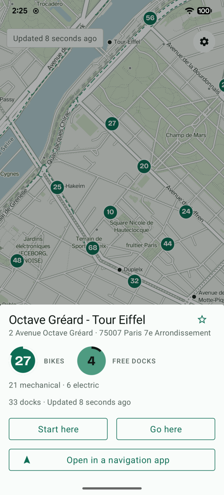
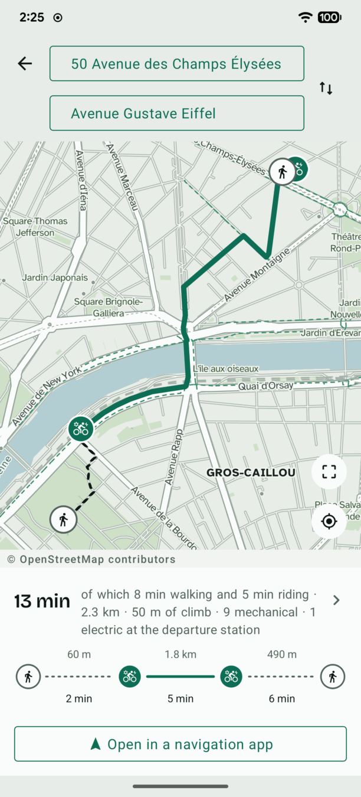

<p align="center">
  
</p>

<h1 align="center">Roue Libre</h1>

<p align="center">
  Bike sharing: offline map and journeys, with no tracker.
</p>

<p align="center">
  <a href="LICENSE"></a>
  
  <a href="docs/networks.md"></a>
  
  
</p>

<p align="center">
  <a href="https://f-droid.org/packages/io.github.mgdx.rouelibre/"></a>
  <a href="https://apps.obtainium.imranr.dev/redirect?r=obtainium://app/%7B%22id%22%3A%22io.github.mgdx.rouelibre%22%2C%22url%22%3A%22https%3A%2F%2Fgithub.com%2Fmgdx%2FRoueLibre%22%2C%22author%22%3A%22mgdx%22%2C%22name%22%3A%22Roue%20Libre%22%7D"></a>
</p>

## Description

**Roue Libre** is an Android application that shows the bike-share stations of
hundreds of cities across several countries, and computes the best journey to
make with those bikes — door to door, **walk → bike → walk**. It is designed to
be simple, efficient and privacy-friendly.

<p align="center">
  <picture>
    <source media="(prefers-color-scheme: dark)" srcset="docs/images/journey-shape-dark.svg">
    
  </picture>
</p>

It is free software under the GPLv3, it uses no Google service, and everything
but the live availability of the bikes runs on your phone.

## Screenshots

<p align="center">
  
  
  
</p>

## Features

- 🚲 **337 bike-share networks in 39 countries**, 70,074 stations, from Vélib'
  to Auch's ten, by way of New York, Montréal, Prague, Barcelona, Dubai, Buenos
  Aires and Pristina. No city is a default: the application proposes the one
  matching your position, measured on where its stations actually are, and you
  choose. The full list is in [`docs/networks.md`](docs/networks.md).

- 🗺️ **A map that shows what a cyclist needs:**
  - cycle ways, drawn apart from the streets;
  - public buildings and landmarks, to find your way by sight;
  - what the city lends, drawn on the bike itself: plain where the network
    lends only mechanical bikes, a bolt where it lends only electric ones, a
    bolt and a cog where it lends both;
  - and in that last case, a station saying how many of its bikes are
    mechanical and how many are electric, and a filter to count only the kind
    you are after.

- 🧭 **The best journey, not the nearest station:**
  - the departure and arrival stations are chosen from the live availability —
    bikes to take at one end, free docks to return to at the other;
  - and where the city lends both, you can even pick the bike you prefer:
    mechanical or electric, and only the stations that really hold one are
    considered;
  - the route follows the cycle ways;
  - the climb is counted and named, because a bike-share bike is heavy.

- 🪶 **Light and frugal.** 9.2 MB of APK, no background service, Android 8 and
  later.

- 🔒 **Private, and local.** Everything happens on the device:
  - the map, streets and routing data are downloaded **once** — 10.7 MB for a
    median city — from the releases of
    [`RoueLibre-data`](https://github.com/mgdx/RoueLibre-data), a repository of
    this project, and that is it. What comes down is **static files and nothing
    else**: a tile archive, a routing graph, an address index. No executable, no
    plug-in, nothing the application runs as code;
  - **that download is yours to start.** Choosing a city reads the published
    manifest to learn what exists and what it weighs; not one byte of a dataset
    moves until you press the button that announces the size, and none of it
    ever moves in the background. The catalogue of cities is fetched the same
    way, when the list of cities is opened and never otherwise. Any of the three
    sets can also be installed **from a file of your own**, produced by the
    scripts in [`tools/`](tools/README.md) — see
    [`docs/offline-data.md`](docs/offline-data.md);
  - the journey is computed on the phone;
  - searching a street or a station never leaves it — it is the most telling
    data the application handles, since it says where you are going;
  - once your city is installed, **the only request that goes out is the
    network's public station feed**, read straight from the operator's own
    server, with no Roue Libre server in between
    ([how](docs/architecture.md#where-the-availability-comes-from)) — which also
    means the operator sees your address and the hour you asked, the price of
    having nobody in the middle
    ([why we say so](docs/architecture.md#what-the-operator-sees));
  - no telemetry, no tracker, no identifier, no history.

## Installing

From [F-Droid](https://f-droid.org/packages/io.github.mgdx.rouelibre/), which
rebuilds the application from this source and updates it along with the rest of
the store. What it serves carries F-Droid's own signature, so an installation
coming from there and one coming from the releases page cannot replace one
another without removing the application first
([why](docs/release.md#f-droid)).

Or from the [releases page](https://github.com/mgdx/RoueLibre/releases/latest):
one APK per architecture — `arm64-v8a` for any phone of the last ten years —
plus a universal one that runs on all of them.

To be told when the next version comes out, add the application to
[Obtainium](https://github.com/ImranR98/Obtainium): it watches this
repository's releases and downloads the APK matching your phone, with no
account and no store in between.

<p align="center">
  <a href="https://f-droid.org/packages/io.github.mgdx.rouelibre/"></a>
  <a href="https://apps.obtainium.imranr.dev/redirect?r=obtainium://app/%7B%22id%22%3A%22io.github.mgdx.rouelibre%22%2C%22url%22%3A%22https%3A%2F%2Fgithub.com%2Fmgdx%2FRoueLibre%22%2C%22author%22%3A%22mgdx%22%2C%22name%22%3A%22Roue%20Libre%22%7D"></a>
</p>

## Building from source

You need a **JDK 17 or later** and the **Android SDK** (compileSdk 37). No key,
no account and no third-party service is required.

**1. Clone with the submodule.** The routing engine is one; cloning without it
gives a build that fails.

```bash
git clone --recurse-submodules https://github.com/mgdx/RoueLibre.git
cd RoueLibre
# on an already cloned repository:
git submodule update --init
```

**2. Build, test, install.**

```bash
./gradlew assembleDebug     # build
./gradlew test              # unit tests, on the JVM, no emulator needed
./gradlew lint ktlintCheck  # static analysis, no warning tolerated
adb install -r app/build/outputs/apk/debug/app-universal-debug.apk
```

**3. Give it a city.** The map, routing and address data are not in the APK.
Generating them takes one command per city:

```bash
tools/generate_all.sh --city config/cities/lille.json
```

It needs `osmium-tool`, `tippecanoe` and Python 3. The whole procedure, the
sizes obtained and the way to add a network are in
[`docs/offline-data.md`](docs/offline-data.md).

The release APK weighs **9.21 MB on arm64-v8a** and 8.67 MB on armeabi-v7a,
map, routing, address search and journeys included, against a ceiling of 12 MB
per architecture.

## Dependencies

A dozen, no more, and each one is argued in
[`docs/dependencies.md`](docs/dependencies.md): what it does, and why it rather
than another. There is no analytics, crash-reporting or advertising library
under any pretext.

## Contributing

Contributions are welcome — see **[CONTRIBUTING.md](CONTRIBUTING.md)**, and open
an issue before a large change.

- 🌍 **Translate.** The most useful contribution if you do not write code.
  Twenty-nine languages have a file waiting, still holding its English text.
- 🏙️ **Add a network,** or teach the address search the abbreviations of your
  language — one JSON file each, no code. See
  [`docs/offline-data.md`](docs/offline-data.md).
- 🐛 **Report a bug** with the device, the Android version and the way to
  reproduce it. The application sends no log anywhere; if you attach one, read
  it through first. A security flaw goes to [`SECURITY.md`](SECURITY.md)
  rather than to a public issue.
- 💻 **Write code.** `./gradlew test lint ktlintCheck` must pass without a single
  warning, business logic goes into `:core` with no Android import, and not a
  single string is hard-coded.

Read [`SPEC.md`](SPEC.md) first: it is the project's source of truth, and it
argues the decisions that look arbitrary.

To go further: the [architecture](docs/architecture.md), the
[offline data](docs/offline-data.md), the
[dependencies](docs/dependencies.md), the
[list of networks](docs/networks.md),
[opening a place from another application](docs/sharing-links.md), how a
[release is published and signed](docs/release.md), and the
[CHANGELOG](CHANGELOG.md).

And if none of that is for you: a ⭐ on the repository is what makes Roue Libre
visible to the next person looking for a bike-share application that spies on
nobody.

## What "Roue Libre" means

*Roue libre* is French for **freewheel**: the ratchet that lets a bicycle carry
on rolling while the pedals stand still. To ride *en roue libre* is to coast —
to be carried by what you have already put in, without pushing.

The phrase is doing three things at once, and all three are the project:

- **the freewheel** itself, the part that makes a bike a bike;
- ***libre-service***, French for self-service — a bike-share bike is a *vélo en
  libre-service*, which is what this application is about;
- ***logiciel libre***, free software. Not free of charge: free as in free to
  use, study, change and pass on. This one is under the GPL.

One word, and it says: a bicycle, shared, and free.

## Licence

[GPLv3](LICENSE). The embedded fonts keep their own,
the [SIL Open Font License](app/src/main/assets/licences/).

The map, the routes and the house numbers come from
[OpenStreetMap](https://www.openstreetmap.org/copyright) and, in France, from
the [Base Adresse Nationale](https://adresse.data.gouv.fr/), both ODbL; the
availability comes from each network's own GBFS feed. The complete list of
sources and their licences is in
[`docs/offline-data.md`](docs/offline-data.md#data-sources-and-attributions).
